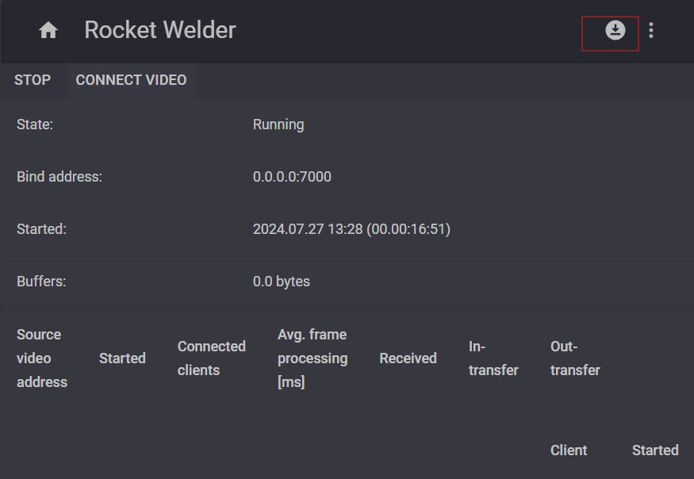
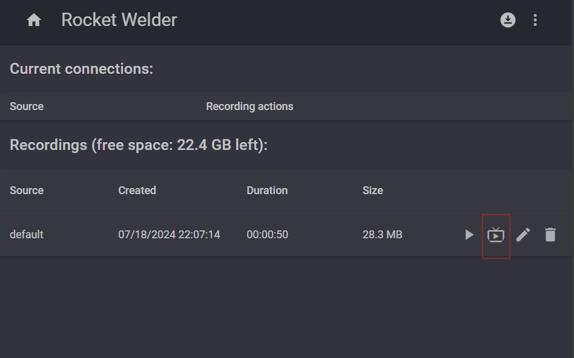

# Rocket Welder Simulator

## Prerequisites

Make sure you have installed:
- git
- Docker Desktop

## Getting started

1. Clone repository

```bash
git clone https://github.com/modelingevolution/rocket-welder-docker-sdk.git
```

2. Run the simulator with the command:

```bash
cd rocket-welder-docker-sdk
sudo docker compose up -d
```
3. Copy your mp4 files into ./data-storage folder
4. Open the browser and navigate to the url: http://localhost:8080
5. Click "Downloader" the button in the right upper corner.



6. Start the simulator by clicking a button next to the file.



7. Wait a bit, the file is being decoded and then you can watch it in home-page.
8. Now can connect your SDK to URL: tcp://localhost:7000/<name-of-the-file>

Enjoy.

## Q & A

1. How to stop the stream?

Navigate to the status page (right upper corner), and click bin next to the stream.

2. Can you stream many files in parallel?

Yes, but you might need to increase the limit in docker-compose for buffer. Each file requires at least 1.4GB RAM for buffers.